# Energy Factory 인프라 아키텍처 다이어그램

## 전체 인프라 아키텍처

```mermaid
graph TB
    User[사용자<br/>웹 브라우저]

    subgraph "도메인 & DNS"
        Gabia[가비아<br/>Registrar<br/>energy-factory.kr]
        Route53[AWS Route 53<br/>Hosted Zone<br/>DNS 관리]
    end

    subgraph "SSL & CDN"
        ACM[AWS ACM<br/>SSL 인증서<br/>us-east-1]
        CloudFront[AWS CloudFront<br/>d1o0ytu060swr1.cloudfront.net<br/>HTTPS 배포]
    end

    subgraph "프론트엔드"
        S3[AWS S3 Bucket<br/>React 정적 파일<br/>HTML/JS/CSS]
    end

    subgraph "백엔드 - AWS EC2"
        EC2[EC2 Ubuntu<br/>Spring Boot :8080<br/>systemd 서비스]
    end

    subgraph "데이터 저장소 - ap-northeast-2"
        RDS[AWS RDS<br/>MySQL 8.0<br/>에너지 공장 DB]
        Redis[Redis 7.2<br/>RefreshToken 캐시<br/>TTL 7일]
    end

    subgraph "AWS 서비스"
        SES[AWS SES<br/>이메일 발송<br/>noreply@energy-factory.kr]
    end

    subgraph "외부 서비스"
        Toss[토스페이먼츠<br/>결제 승인/취소<br/>API]
        NaverOAuth[네이버 OAuth2<br/>소셜 로그인<br/>계정 연동]
    end

    subgraph "CI/CD"
        GitHub[GitHub Actions<br/>자동 배포<br/>main 브랜치]
    end

    User -->|HTTPS| Gabia
    Gabia -->|네임서버 위임| Route53
    Route53 -->|A Record| CloudFront
    ACM -->|SSL 인증서| CloudFront

    CloudFront -->|/* 정적 파일| S3
    CloudFront -->|/api/* 백엔드| EC2

    EC2 -->|쿼리| RDS
    EC2 -->|RefreshToken 저장/조회| Redis
    EC2 -->|비밀번호 재설정 이메일| SES
    EC2 -->|결제 승인/취소| Toss
    EC2 -->|소셜 로그인| NaverOAuth

    GitHub -->|SSH 배포| EC2

    style User fill:#e1f5ff
    style CloudFront fill:#ff9900
    style S3 fill:#569a31
    style EC2 fill:#ff9900
    style RDS fill:#527fff
    style Redis fill:#dc382d
    style Route53 fill:#8c4fff
    style ACM fill:#dd344c
    style SES fill:#dd344c
    style Toss fill:#0064ff
    style NaverOAuth fill:#03c75a
    style GitHub fill:#24292e
```

## 상세 배포 플로우

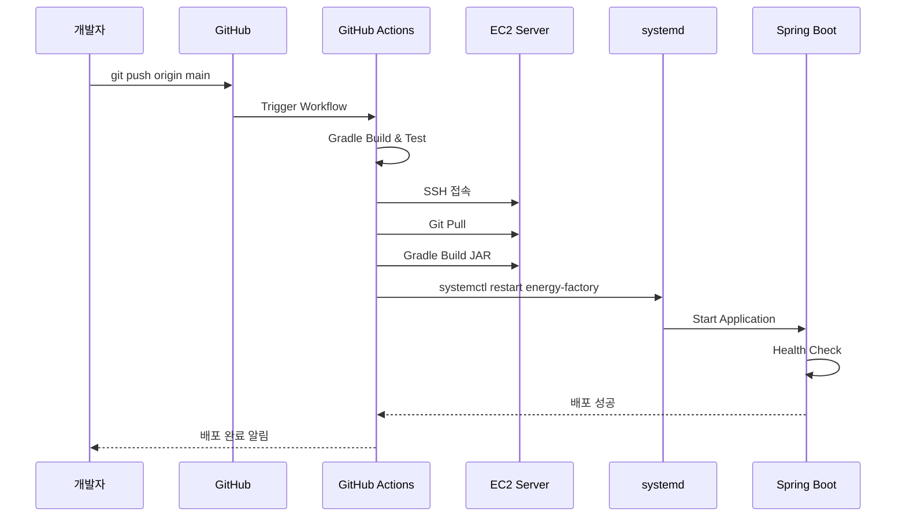

## 사용자 요청 플로우

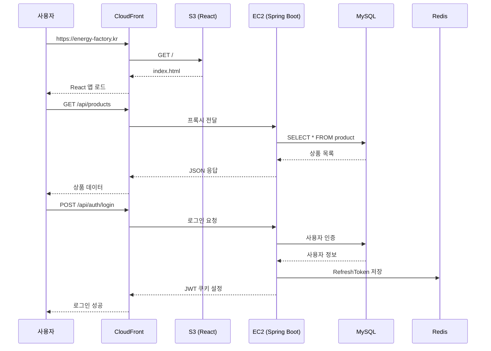

## 결제 플로우

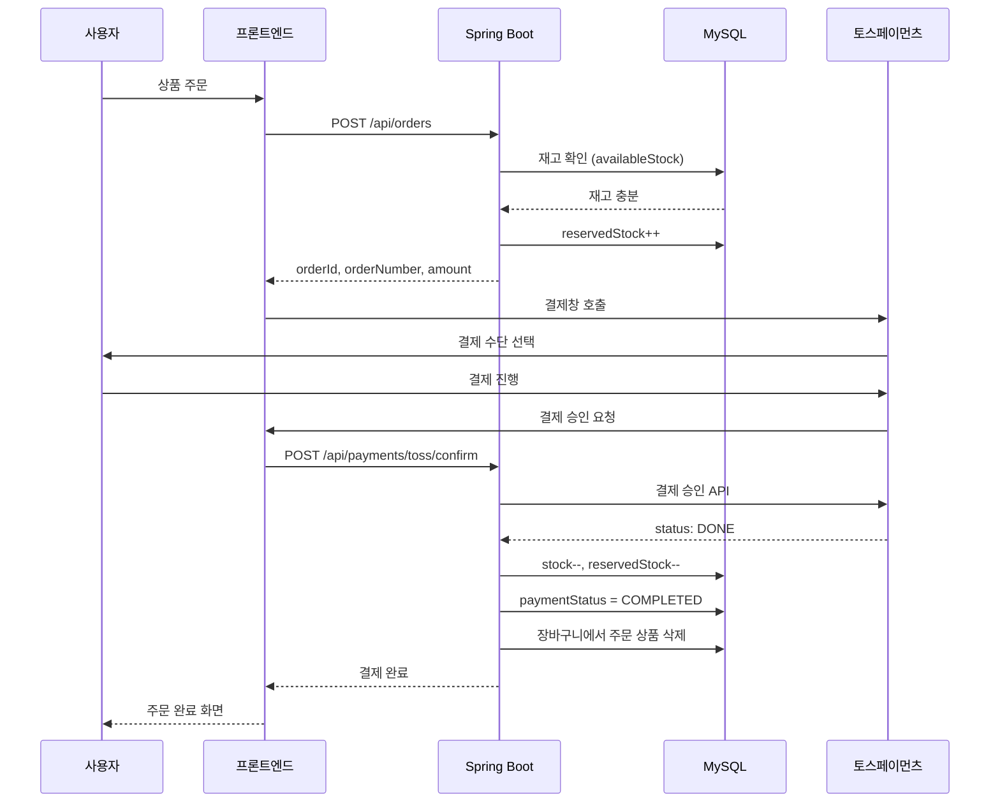

## OAuth2 소셜 로그인 플로우

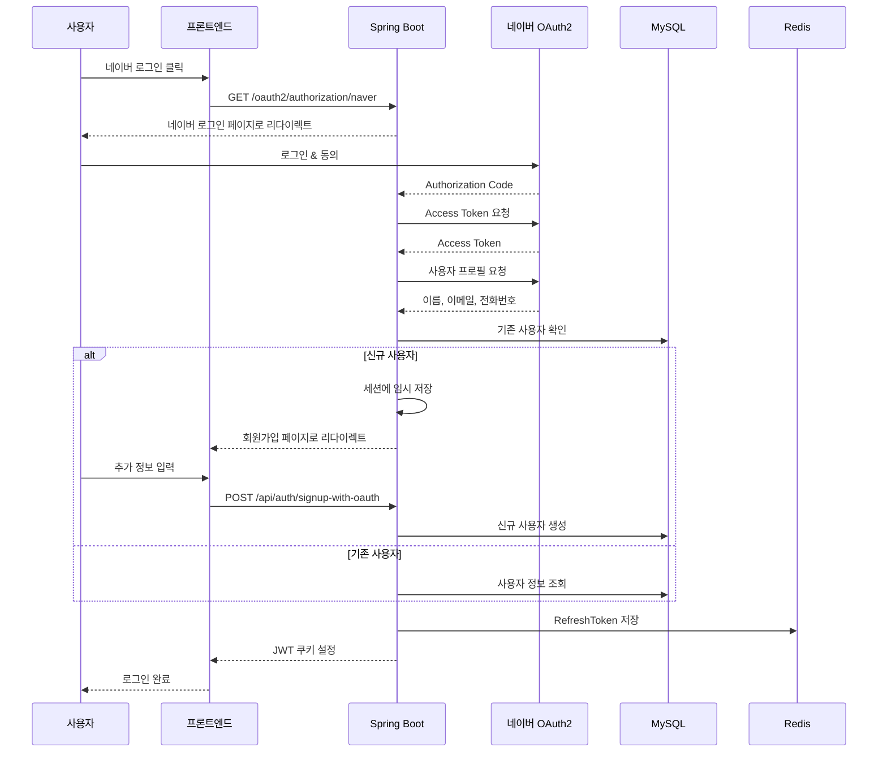

## 재고 예약 시스템

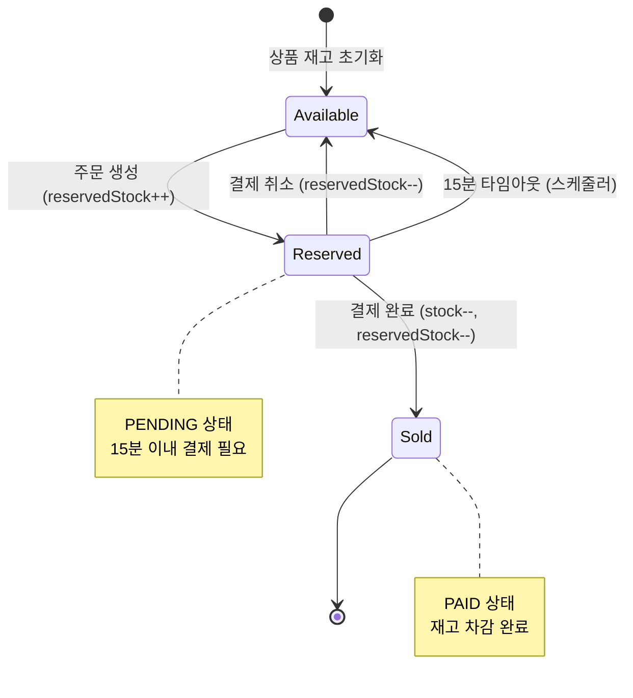

## 데이터베이스 ERD 요약

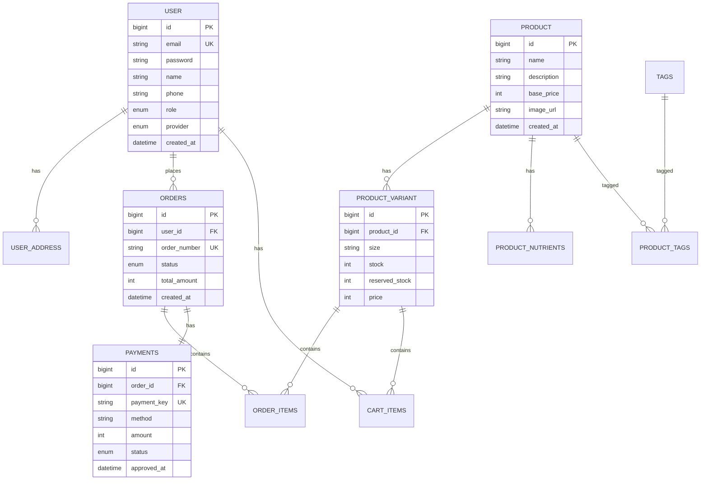

## 네트워크 구성

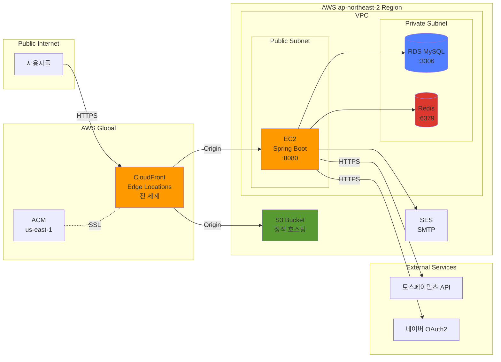

## 보안 구성

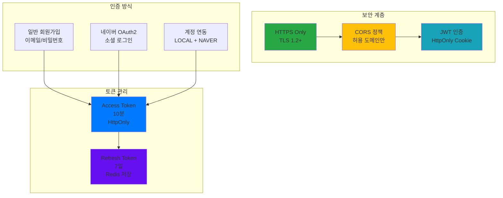

## 비용 구조 (월간 예상)

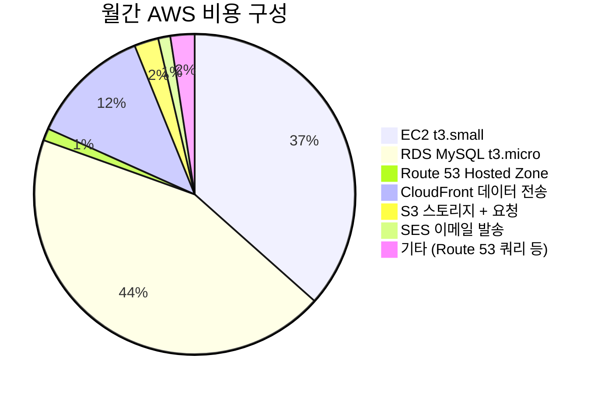

## 모니터링 포인트 (개선 필요)

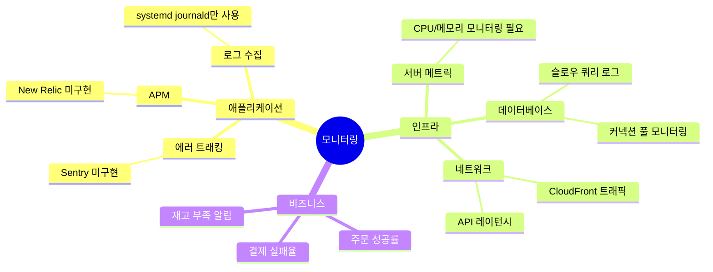

---

## 다이어그램 사용 가이드

### Mermaid 다이어그램 렌더링

이 문서의 다이어그램은 Mermaid 형식으로 작성되었습니다. 다음 환경에서 자동으로 렌더링됩니다:

1. **GitHub** - 마크다운 파일을 GitHub에서 열면 자동 렌더링
2. **VS Code** - Mermaid Preview 확장 설치
3. **IntelliJ IDEA** - 기본 마크다운 뷰어에서 지원
4. **온라인 에디터** - https://mermaid.live 에서 편집 가능

### 다이어그램 내보내기

1. **PNG/SVG 생성**: https://mermaid.live 에서 코드 복사 후 Export
2. **PDF 생성**: VS Code에서 "Markdown PDF" 확장 사용
3. **Draw.io 변환**: Mermaid 코드를 Draw.io로 import 가능

---

## 업데이트 이력

- 2025-11-11: 초기 인프라 다이어그램 작성
  - 전체 아키텍처 다이어그램
  - CI/CD 플로우
  - 사용자 요청 플로우
  - 결제 플로우
  - OAuth2 로그인 플로우
  - 재고 예약 시스템
  - ERD 요약
  - 네트워크 구성
  - 보안 구성
  - 비용 구조

---

## 참고 자료

- [Mermaid 공식 문서](https://mermaid.js.org/)
- [AWS 아키텍처 아이콘](https://aws.amazon.com/architecture/icons/)
- [CloudFront 커스텀 도메인 설정](./cloudfront-custom-domain.md)
- [CI/CD 구축 가이드](./ci-cd/README.md)
