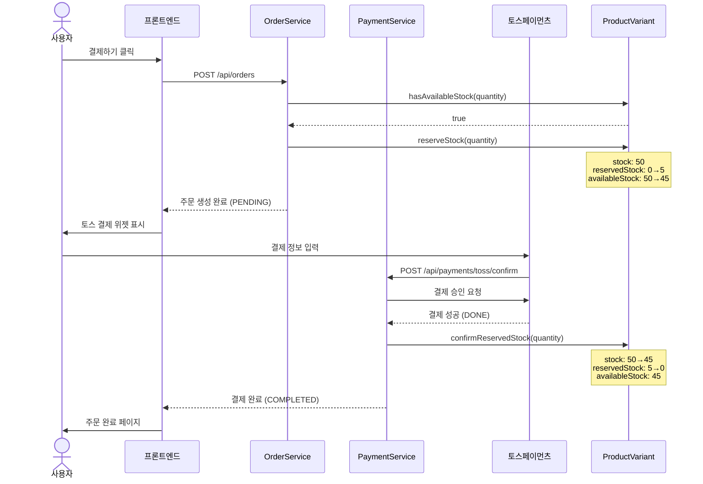
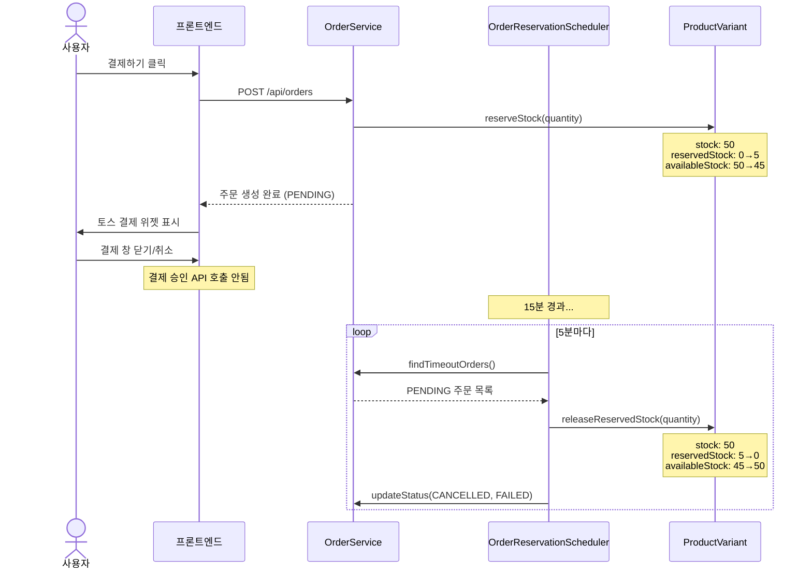
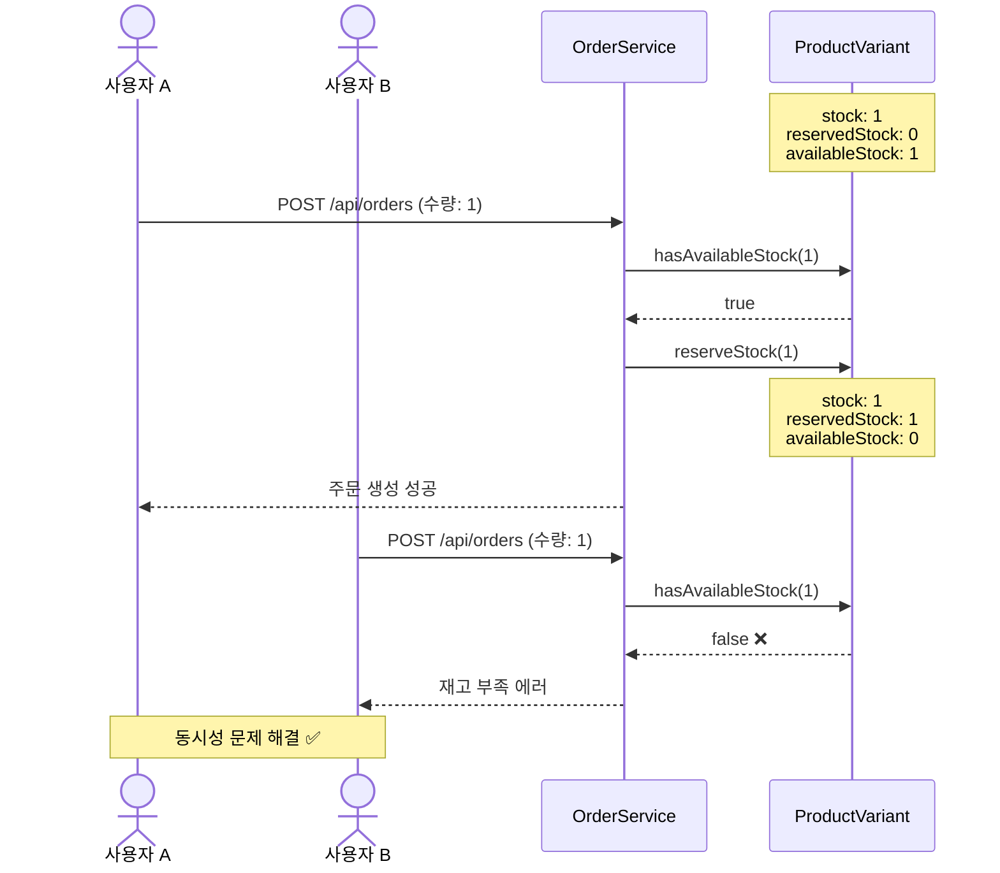

# 재고 관리 및 결제 시스템 문서

## 📋 목차
1. [시스템 개요](#시스템-개요)
2. [재고 예약 시스템](#재고-예약-시스템)
3. [주요 프로세스](#주요-프로세스)
4. [시퀀스 다이어그램](#시퀀스-다이어그램)
5. [API 명세](#api-명세)
6. [예외 처리](#예외-처리)

---

## 시스템 개요

### 문제점
기존 시스템에서는 주문 생성 시 즉시 재고를 차감했으나, 사용자가 결제를 취소하거나 이탈하면 재고가 복구되지 않아 **재고 부정확** 및 **동시성 문제**(overselling)가 발생했습니다.

### 해결 방안
**재고 예약 시스템**을 도입하여:
- 주문 생성 시 재고를 예약만 하고 총재고는 차감하지 않음
- 결제 완료 시 예약을 확정하고 총재고를 차감
- 결제 취소 또는 타임아웃 시 예약을 해제하여 재고 복구
- 15분 이상 PENDING 상태인 주문은 자동으로 취소 및 예약 해제

---

## 재고 예약 시스템

### 재고 상태 구성

```
ProductVariant {
    stock: 50           // 총 재고
    reservedStock: 5    // 예약된 재고 (결제 진행 중)
    availableStock: 45  // 판매 가능한 재고 = stock - reservedStock
}
```

### 핵심 메서드

| 메서드 | 시점 | 동작 |
|--------|------|------|
| `getAvailableStock()` | 재고 조회 | `stock - reservedStock` 반환 |
| `hasAvailableStock(quantity)` | 주문 전 검증 | 판매 가능한 재고 확인 |
| `reserveStock(quantity)` | 주문 생성 시 | `reservedStock += quantity` |
| `releaseReservedStock(quantity)` | 결제 취소/타임아웃 | `reservedStock -= quantity` |
| `confirmReservedStock(quantity)` | 결제 완료 시 | `stock -= quantity`, `reservedStock -= quantity` |

### 코드 예시

```java
// 주문 생성 시
if (!variant.hasAvailableStock(quantity)) {
    throw new BusinessException(INSUFFICIENT_STOCK);
}
variant.reserveStock(quantity);  // 예약만

// 결제 완료 시
variant.confirmReservedStock(quantity);  // 예약 확정 + 총재고 차감

// 결제 취소 시
variant.releaseReservedStock(quantity);  // 예약 해제
```

---

## 주요 프로세스

### 1. 주문 생성 프로세스

```
사용자 → "결제하기" 클릭
    ↓
POST /api/orders (주문 생성)
    ↓
판매 가능한 재고 확인 (availableStock >= quantity)
    ↓
재고 예약 (reservedStock += quantity)
    ↓
주문 상태: PENDING, 결제 상태: PENDING
    ↓
토스 결제 위젯 표시
```

**코드 위치:**
- `OrderService.createOrder()` - 직접 주문 (87-98라인)
- `OrderService.createOrderFromCart()` - 장바구니 주문 (332-345라인)

### 2. 결제 완료 프로세스

```
사용자 → 결제 정보 입력 및 승인
    ↓
POST /api/payments/toss/confirm
    ↓
토스페이먼츠 API 호출
    ↓
결제 성공 (status: DONE)
    ↓
예약 확정 (stock -= quantity, reservedStock -= quantity)
    ↓
주문 상태: PENDING, 결제 상태: COMPLETED
    ↓
장바구니 삭제
```

**코드 위치:** `PaymentService.confirmTossPayment()` (137-146라인)

### 3. 결제 취소 프로세스

```
사용자 → "결제하기" 클릭 → 결제 창 닫기/취소
    ↓
결제 승인 API 호출 안됨
    ↓
주문은 PENDING 상태로 DB에 남음
    ↓
[5분마다 스케줄러 실행]
    ↓
15분 이상 PENDING 주문 조회
    ↓
예약 해제 (reservedStock -= quantity)
    ↓
주문 상태: CANCELLED, 결제 상태: FAILED
```

**코드 위치:**
- 수동 취소: `OrderService.cancelOrder()` (222-240라인)
- 자동 타임아웃: `OrderReservationScheduler.releaseTimeoutReservations()` (42-90라인)

### 4. 결제 완료 후 환불 프로세스

```
사용자 → 결제 완료된 주문 취소
    ↓
POST /api/payments/{paymentId}/cancel
    ↓
토스페이먼츠 취소 API 호출
    ↓
취소 성공 (status: CANCELED)
    ↓
재고 복원 (stock += quantity)
    ↓
주문 상태: CANCELLED, 결제 상태: REFUNDED
```

**코드 위치:** `PaymentService.cancelTossPayment()` (206-215라인)

---

## 시퀀스 다이어그램

### 1. 정상 결제 플로우



### 2. 결제 취소 플로우



### 3. 동시 주문 시나리오 (재고 1개)



### 4. 타임아웃 처리 타임라인

```mermaid
gantt
    title 주문 타임아웃 처리 타임라인
    dateFormat HH:mm
    axisFormat %H:%M

    section 사용자 A
    주문 생성 (재고 예약)     :a1, 14:00, 1m
    결제 대기 중...           :a2, 14:01, 14m
    타임아웃 (예약 해제)      :crit, a3, 14:15, 1m

    section 스케줄러
    스케줄 실행               :milestone, 14:00, 0m
    스케줄 실행               :milestone, 14:05, 0m
    스케줄 실행               :milestone, 14:10, 0m
    스케줄 실행 (주문 취소)   :crit, milestone, 14:15, 0m
    스케줄 실행               :milestone, 14:20, 0m
```



---

## API 명세

### 주문 생성
```http
POST /api/orders
Content-Type: application/json

{
  "items": [
    {
      "productId": 1,
      "variantId": 1,
      "quantity": 2,
      "price": 29900.00
    }
  ],
  "recipientName": "홍길동",
  "phoneNumber": "010-1234-5678",
  "postalCode": "12345",
  "addressLine1": "서울시 강남구",
  "addressLine2": "101호"
}
```

**응답:**
```json
{
  "code": "201",
  "message": "SUCCESS_POST",
  "data": {
    "orderId": 123,
    "orderNumber": 20251107001,
    "totalPrice": 59800.00,
    "status": "PENDING",
    "paymentStatus": "PENDING"
  }
}
```

### 상품 변형 조회 (재고 정보)
```http
GET /api/products/1/variants
```

**응답:**
```json
{
  "code": "200",
  "message": "SUCCESS",
  "data": [
    {
      "id": 1,
      "name": "500g",
      "price": 29900.00,
      "stock": 50,
      "reservedStock": 5,
      "availableStock": 45
    }
  ]
}
```

### 주문 목록 조회
```http
GET /api/orders
GET /api/orders?paymentStatus=COMPLETED
GET /api/orders?paymentStatus=PENDING
```

**기본 동작:** PENDING 주문은 자동으로 제외됨

---

## 예외 처리

### 1. 재고 부족
```java
// 판매 가능한 재고가 부족한 경우
throw new IllegalStateException(
    "판매 가능한 재고가 부족합니다. 요청: 5, 판매 가능: 2 (총재고: 10, 예약중: 8)"
);
```

### 2. 예약 재고 부족
```java
// 예약 해제 시 예약 재고가 부족한 경우
throw new IllegalStateException(
    "예약 재고가 부족합니다. 요청: 5, 예약중: 3"
);
```

### 3. 결제 승인 실패
```java
// 토스페이먼츠 API 호출 실패
// 트랜잭션 롤백으로 주문 상태 복구
```

### 4. 동시성 충돌
```java
// JPA 낙관적 락 사용 시 (선택사항)
@Version
private Long version;
```

---

## 설정 및 구성

### 스케줄러 설정
```java
@SpringBootApplication
@EnableScheduling  // 스케줄링 활성화
public class EnergyFactoryApplication {
    // ...
}
```

### 타임아웃 설정
```java
// OrderReservationScheduler.java
private static final int RESERVATION_TIMEOUT_MINUTES = 15;  // 타임아웃 시간

@Scheduled(cron = "0 */5 * * * *")  // 실행 주기: 5분
```

---

## 모니터링 및 로깅

### 재고 예약 로그
```
INFO - 재고 예약 확정 - 상품변형 ID: 1, 수량: 2, 남은 재고: 45
INFO - 재고 복원 - 상품변형 ID: 1, 수량: 2, 복원 후 재고: 47
```

### 스케줄러 로그
```
INFO - 타임아웃된 주문 3건 발견, 재고 예약 해제 시작
DEBUG - 재고 예약 해제 - 주문번호: 20251107001, 상품변형 ID: 1, 수량: 2
INFO - 재고 예약 해제 완료 - 성공: 3건, 실패: 0건
```

---

## 테스트 시나리오

### 1. 정상 결제
1. 주문 생성 → `availableStock` 감소 확인
2. 결제 완료 → `stock` 감소, `reservedStock` 감소 확인
3. 주문 상태 COMPLETED 확인

### 2. 결제 취소
1. 주문 생성 → `availableStock` 감소 확인
2. 결제 창 닫기 (15분 대기)
3. 스케줄러 실행 → `availableStock` 복구 확인
4. 주문 상태 CANCELLED 확인

### 3. 동시 주문
1. 재고 1개 설정
2. 두 사용자가 동시에 주문 시도
3. 한 명만 성공, 다른 한 명은 재고 부족 에러 확인

### 4. 환불
1. 결제 완료된 주문 생성
2. 환불 요청 → `stock` 복구 확인
3. 주문 상태 CANCELLED, REFUNDED 확인

---

## 주요 파일 위치

| 파일 | 경로 | 설명 |
|------|------|------|
| ProductVariant.java | `entity/ProductVariant.java` | 재고 예약 메서드 구현 |
| OrderService.java | `service/OrderService.java` | 주문 생성 및 취소 로직 |
| PaymentService.java | `service/PaymentService.java` | 결제 승인 및 취소 로직 |
| OrderReservationScheduler.java | `scheduler/OrderReservationScheduler.java` | 타임아웃 자동 처리 |
| OrderRepository.java | `repository/OrderRepository.java` | 타임아웃 주문 조회 쿼리 |
| ProductVariantDto.java | `dto/ProductVariantDto.java` | API 응답 DTO |

---

## FAQ

### Q1: 왜 재고 예약 시스템이 필요한가요?
**A:** 주문 생성 후 결제 완료까지 시간차가 있어, 즉시 재고를 차감하면 결제 취소 시 재고 복구가 누락될 수 있습니다. 재고 예약 시스템은 이 문제를 해결합니다.

### Q2: 타임아웃 시간은 왜 15분인가요?
**A:** 토스페이먼츠의 일반적인 결제 위젯 세션 시간을 고려하여 설정했습니다. 필요 시 `RESERVATION_TIMEOUT_MINUTES` 상수를 변경할 수 있습니다.

### Q3: 스케줄러 실행 주기를 변경하려면?
**A:** `@Scheduled(cron = "0 */5 * * * *")`를 수정하세요. 예: `"0 */10 * * * *"` (10분마다)

### Q4: 동시성 문제는 완전히 해결되나요?
**A:** 재고 예약 시스템으로 대부분의 overselling 문제를 방지할 수 있습니다. 극한의 동시성 환경에서는 추가로 낙관적 락(`@Version`)이나 비관적 락을 고려할 수 있습니다.

### Q5: 프론트엔드에서 어떤 재고를 표시해야 하나요?
**A:** `availableStock`을 표시하세요. 이것이 실제 구매 가능한 재고입니다.

---

## 업데이트 히스토리

- **2025-11-07**: 재고 예약 시스템 초기 구현
  - ProductVariant에 reservedStock 필드 추가
  - 주문-결제 프로세스 개선
  - 타임아웃 자동 처리 스케줄러 구현
