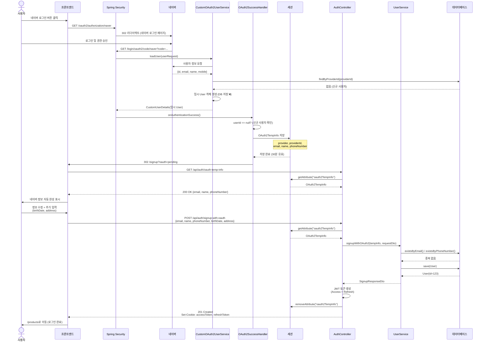
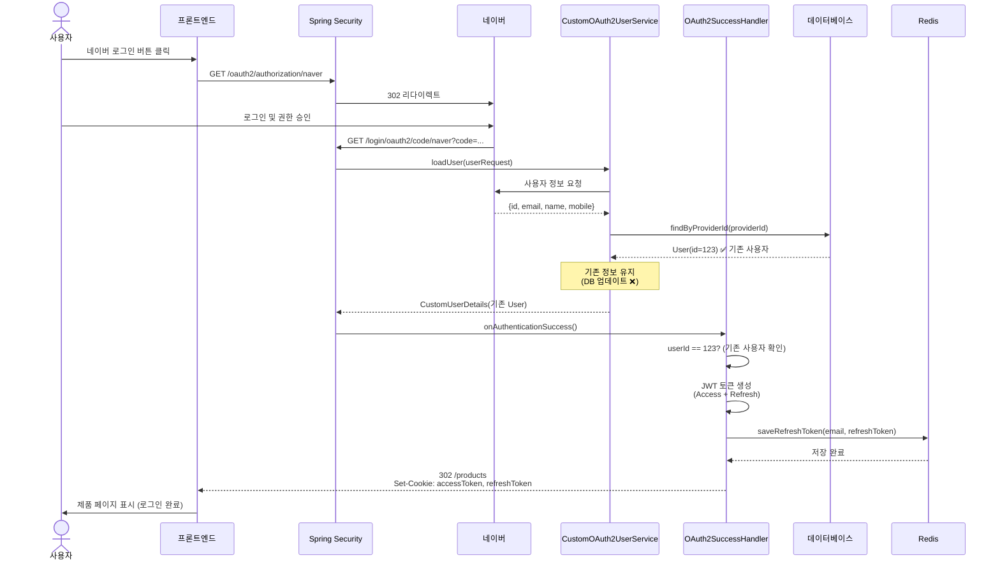
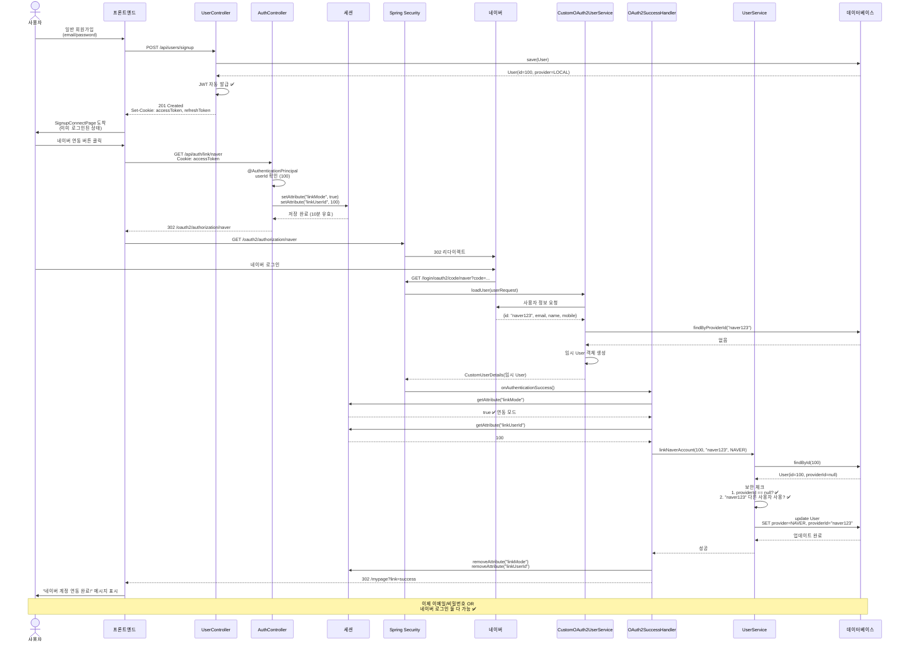
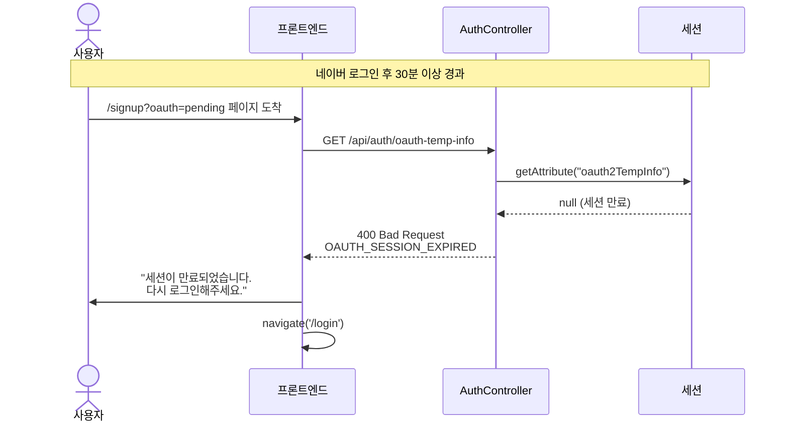
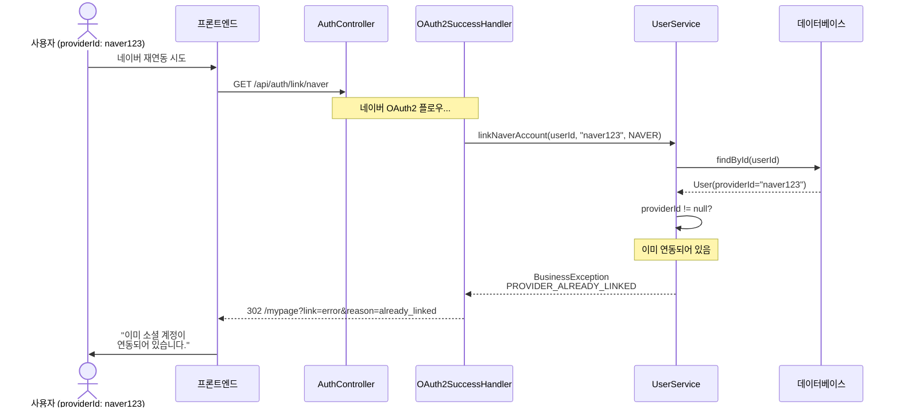
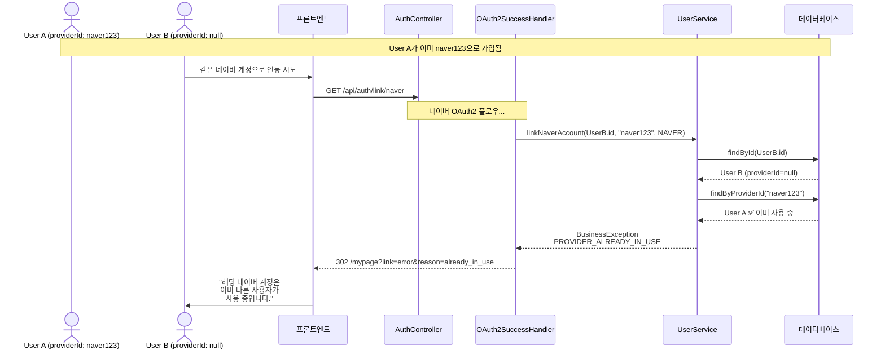

# 네이버 OAuth2 시퀀스 다이어그램

> 작성일: 2025-11-06
> 버전: 1.0.0
> 관련 문서: [naver-oauth2-integration.md](./naver-oauth2-integration.md)

## 목차
1. [신규 사용자 네이버 가입](#1-신규-사용자-네이버-가입)
2. [기존 사용자 네이버 로그인](#2-기존-사용자-네이버-로그인)
3. [LOCAL 계정 네이버 연동](#3-local-계정-네이버-연동)

---

## 1. 신규 사용자 네이버 가입

**시나리오**: 처음으로 네이버 계정으로 서비스에 가입하는 사용자

**핵심 포인트**:
- 네이버 정보를 세션에 임시 저장 (DB 저장 ❌)
- 사용자가 추가 정보 입력 후 회원가입 완료 시점에 DB 저장
- 회원가입 완료 후 JWT 자동 발급



**주요 단계 설명**:

| 단계 | 설명 | 비고 |
|------|------|------|
| 1-3 | 네이버 로그인 시작 | Spring Security OAuth2가 자동 처리 |
| 4-6 | 네이버 사용자 정보 조회 | CustomOAuth2UserService.loadUser() |
| 7-8 | 신규 사용자 확인 | findByProviderId() → 없음 |
| 9-10 | 임시 User 객체 생성 | **DB 저장하지 않음** |
| 11-13 | 세션에 임시 저장 | OAuth2TempInfo (30분 유효) |
| 14 | 회원가입 페이지로 이동 | /signup?oauth=pending |
| 15-17 | 네이버 정보 조회 | GET /api/auth/oauth-temp-info |
| 18-19 | 사용자 입력 | 네이버 정보 수정 + 추가 정보 입력 |
| 20-25 | 회원가입 완료 | **이 시점에 DB 저장** |
| 26-28 | JWT 발급 및 리다이렉트 | 자동 로그인 완료 |

---

## 2. 기존 사용자 네이버 로그인

**시나리오**: 이미 네이버로 가입한 사용자가 다시 로그인

**핵심 포인트**:
- providerId로 기존 사용자 찾기
- 기존 정보 유지 (업데이트 ❌)
- JWT 발급 후 홈으로 바로 이동



**주요 단계 설명**:

| 단계 | 설명 | 비고 |
|------|------|------|
| 1-6 | 네이버 로그인 | 신규 가입과 동일 |
| 7-8 | 기존 사용자 확인 | findByProviderId() → **있음** |
| 9-10 | 기존 User 반환 | DB 업데이트하지 않음 |
| 11-14 | JWT 발급 | Access + Refresh Token |
| 15-16 | Redis에 저장 | Refresh Token 저장 |
| 17-18 | 홈으로 리다이렉트 | 추가 정보 입력 없이 바로 로그인 |

---

## 3. LOCAL 계정 네이버 연동

**시나리오**: 이메일/비밀번호로 가입한 사용자가 네이버 계정을 추가 연동

**핵심 포인트**:
- 일반 회원가입 시 JWT 자동 발급 (자동 로그인)
- 로그인된 상태에서 네이버 연동
- 보안 체크: providerId 중복 방지, 재연동 방지
- 연동 후 두 가지 방법으로 로그인 가능



**주요 단계 설명**:

| 단계 | 설명 | 비고 |
|------|------|------|
| 1-4 | 일반 회원가입 | POST /api/users/signup |
| 5-6 | JWT 자동 발급 | **회원가입 후 자동 로그인** |
| 7-8 | SignupConnectPage 도착 | 이미 로그인된 상태 |
| 9-12 | 네이버 연동 시작 | GET /api/auth/link/naver |
| 13-15 | 연동 모드 저장 | linkMode=true, linkUserId=100 |
| 16-23 | 네이버 OAuth2 플로우 | 일반 로그인과 동일 |
| 24-27 | 연동 모드 확인 | linkMode == true? |
| 28-32 | 계정 연동 실행 | linkNaverAccount() |
| 33-35 | 보안 체크 | providerId 중복 방지 |
| 36-37 | DB 업데이트 | provider=NAVER, providerId 추가 |
| 38-40 | 연동 완료 | 세션 정리 및 리다이렉트 |
| 41 | 성공 메시지 | /mypage?link=success |

---

## 에러 시나리오

### 에러 1: 세션 만료 (신규 가입)



### 에러 2: 이미 연동된 계정 (재연동 시도)



### 에러 3: 다른 사용자가 사용 중인 providerId



---

## 데이터베이스 상태 변화

### 신규 가입 플로우

```sql
-- 1. 네이버 로그인 (세션에만 저장)
-- DB 변화 없음

-- 2. 회원가입 완료 (POST /api/auth/signup-with-oauth)
INSERT INTO user (
    email, name, password, phone_number, birth_date, address,
    provider, provider_id, role, created_at
) VALUES (
    'hong@naver.com', '홍길동', '$2a$10$...', '010-1234-5678',
    '1990-01-01', '서울시 강남구',
    'NAVER', '12345678', 'USER', NOW()
);
-- Result: id=123
```

### 기존 사용자 로그인 플로우

```sql
-- 1. 네이버 로그인
SELECT * FROM user WHERE provider_id = '12345678';
-- Result: User(id=123, email='hong@naver.com', ...)

-- 2. DB 업데이트 없음 (기존 정보 유지)
```

### 계정 연동 플로우

```sql
-- 1. 일반 회원가입
INSERT INTO user (
    email, name, password, phone_number, birth_date, address,
    provider, provider_id, role, created_at
) VALUES (
    'user@example.com', '김철수', '$2a$10$...', '010-9999-8888',
    '1995-05-05', '서울시 종로구',
    'LOCAL', NULL, 'USER', NOW()
);
-- Result: id=100

-- 2. 네이버 연동 (PUT)
UPDATE user
SET provider = 'NAVER',
    provider_id = 'naver123',
    updated_at = NOW()
WHERE id = 100;
-- Result: 1 row affected

-- 3. 이후 두 가지 방법으로 로그인 가능
-- 방법 1: 이메일/비밀번호 (기존 password 유지)
-- 방법 2: 네이버 (providerId로 찾기)
```

---

## 참고 사항

### Mermaid 렌더링

이 문서의 시퀀스 다이어그램은 Mermaid 형식으로 작성되었습니다.

**지원 플랫폼**:
- GitHub (자동 렌더링)
- GitLab (자동 렌더링)
- VS Code (Mermaid Preview 확장 설치)
- IntelliJ IDEA (Mermaid 플러그인 설치)

**온라인 에디터**:
- [Mermaid Live Editor](https://mermaid.live/)

### 관련 문서

- [네이버 OAuth2 통합 가이드](./naver-oauth2-integration.md) - 상세 구현 설명
- [API 명세서](./naver-oauth2-integration.md#api-명세)
- [테스트 시나리오](./naver-oauth2-integration.md#테스트-시나리오)

---

## 변경 이력

| 날짜 | 버전 | 변경 내용 | 작성자 |
|------|------|-----------|--------|
| 2025-11-06 | 1.0.0 | 시퀀스 다이어그램 초안 작성 | Backend Team |

---

## 라이선스

Copyright (c) 2025 Energy Factory. All rights reserved.
