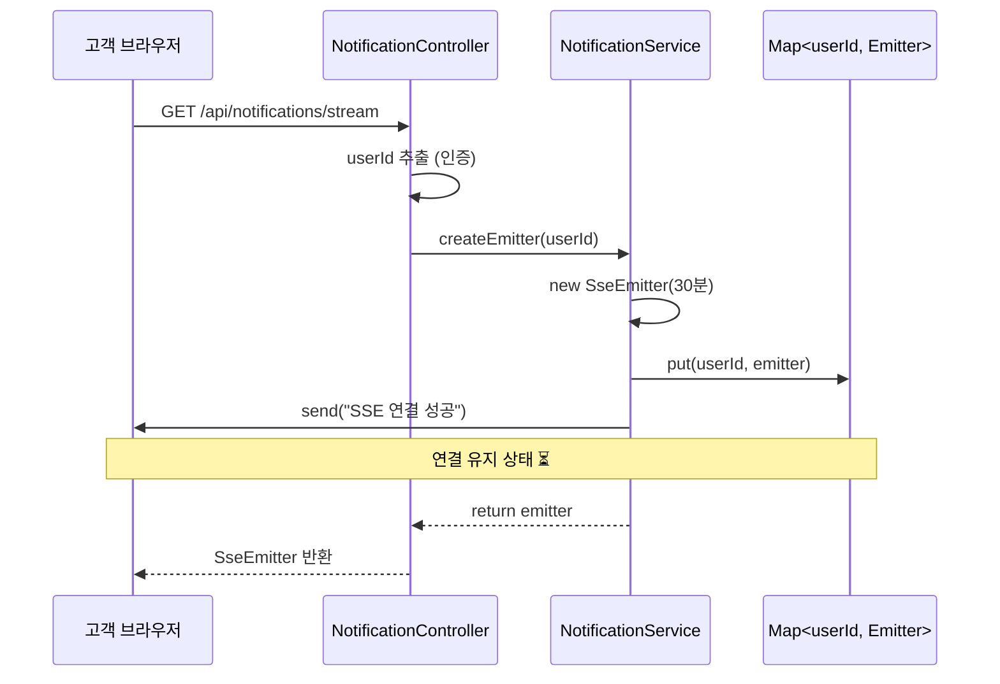
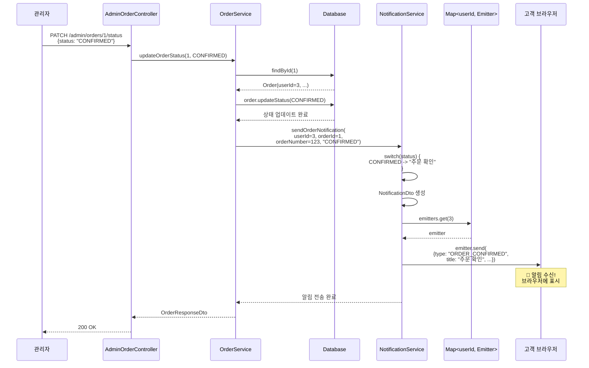
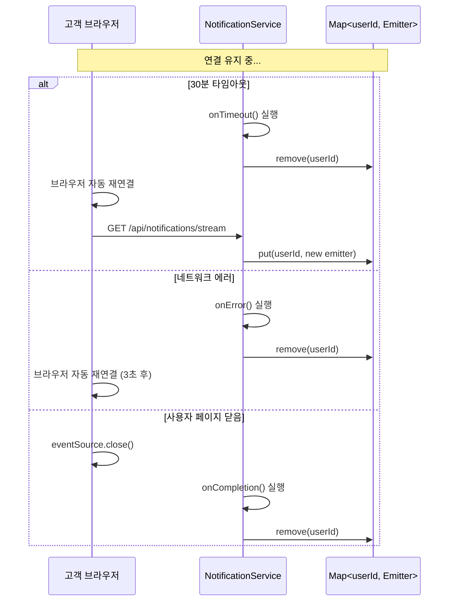

# SSE 기반 주문 알림 시스템 구현 문서

## 📋 목차
1. [개요](#개요)
2. [구현 배경](#구현-배경)
3. [기술 스택](#기술-스택)
4. [시스템 아키텍처](#시스템-아키텍처)
5. [시퀀스 다이어그램](#시퀀스-다이어그램)
6. [API 명세](#api-명세)
7. [구현 세부사항](#구현-세부사항)
8. [테스트 방법](#테스트-방법)
9. [향후 개선 사항](#향후-개선-사항)

---

## 개요

주문 상태가 변경될 때 고객에게 실시간 알림을 전송하는 SSE(Server-Sent Events) 기반 알림 시스템을 구현했습니다.

### 주요 기능
- ✅ 실시간 주문 상태 알림 (주문확인, 배송시작, 배송완료, 주문취소)
- ✅ SSE를 통한 단방향 실시간 통신
- ✅ 사용자별 알림 연결 관리
- ✅ 자동 재연결 지원
- ✅ 관리자용 주문 상태 변경 API

---

## 구현 배경

### 문제점
- 기존: 고객이 주문 상태를 확인하려면 주문 목록 페이지를 새로고침해야 함
- 실시간성 부족으로 사용자 경험 저하

### 해결 방안
- SSE를 사용한 서버 → 클라이언트 실시간 푸시 알림
- 주문 상태 변경 시 즉시 알림 전송

### 왜 SSE를 선택했는가?
| 기술 | 장점 | 단점 | 선택 이유 |
|------|------|------|-----------|
| **SSE** | 구현 간단, HTTP 기반, 자동 재연결 | 단방향만 가능 | **주문 알림은 서버→클라이언트만 필요** ✅ |
| WebSocket | 양방향, 낮은 지연 | 구현 복잡, 인프라 부담 | 채팅 기능 추가 시 고려 |
| Polling | 간단 | 서버 부하 높음, 실시간성 낮음 | 비효율적 ❌ |

---

## 기술 스택

### 백엔드
- Spring Boot 3.5.5
- Spring Web (SSE 지원)
- Spring Security (인증)
- JPA/Hibernate

### 프론트엔드 (예시)
- EventSource API (브라우저 내장)
- React (선택사항)

---

## 시스템 아키텍처

```
┌─────────────┐
│   고객      │
│  (브라우저)  │
└──────┬──────┘
       │ EventSource 연결
       │ GET /api/notifications/stream
       ▼
┌─────────────────────────────────────┐
│   NotificationController            │
│   - SSE 연결 엔드포인트             │
└──────┬──────────────────────────────┘
       │
       ▼
┌─────────────────────────────────────┐
│   NotificationService               │
│   - Map<userId, SseEmitter> 관리   │
│   - 알림 전송 로직                  │
└──────┬──────────────────────────────┘
       ▲
       │ sendOrderNotification()
       │
┌──────┴──────────────────────────────┐
│   OrderService                      │
│   - 주문 상태 변경                  │
│   - 알림 서비스 호출                │
└──────▲──────────────────────────────┘
       │
       │ updateOrderStatus()
       │
┌──────┴──────────────────────────────┐
│   AdminOrderController              │
│   - 관리자 주문 상태 변경 API       │
└─────────────────────────────────────┘
       ▲
       │ PATCH /api/admin/orders/{id}/status
       │
┌──────┴──────┐
│   관리자    │
└─────────────┘
```

---

## 시퀀스 다이어그램

### 1. SSE 연결 수립



### 2. 주문 상태 변경 및 알림 전송



### 3. 연결 종료 및 재연결



---

## API 명세

### 1. SSE 알림 스트림 연결

#### 요청
```http
GET /api/notifications/stream
Accept: text/event-stream
Authorization: Bearer {token}
```

#### 응답 (SSE 스트림)

**연결 성공 이벤트:**
```
event: connect
data: SSE 연결 성공
```

**알림 이벤트:**
```
event: notification
data: {
  "type": "ORDER_CONFIRMED",
  "title": "주문 확인",
  "message": "주문번호 1234567890번이 확인되었습니다.",
  "orderId": 1,
  "orderNumber": 1234567890,
  "timestamp": "2025-11-07T09:21:00"
}
```

**알림 타입:**
- `ORDER_CONFIRMED` - 주문 확인
- `ORDER_SHIPPED` - 배송 시작
- `ORDER_DELIVERED` - 배송 완료
- `ORDER_CANCELLED` - 주문 취소

### 2. 주문 상태 변경 (관리자)

#### 요청
```http
PATCH /api/admin/orders/{orderId}/status
Content-Type: application/json

{
  "status": "CONFIRMED"
}
```

#### 응답
```json
{
  "code": "SUCCESS",
  "message": "성공",
  "data": {
    "id": 1,
    "orderNumber": 1234567890,
    "status": "CONFIRMED",
    "paymentStatus": "COMPLETED",
    "totalPrice": 50000,
    ...
  }
}
```

#### 주문 상태 (OrderStatus)
```java
PENDING      // 주문접수
CONFIRMED    // 주문확인 (알림 발송)
SHIPPED      // 배송중 (알림 발송)
DELIVERED    // 배송완료 (알림 발송)
CANCELLED    // 주문취소 (알림 발송)
```

### 3. 알림 통계 조회

#### 요청
```http
GET /api/notifications/stats
```

#### 응답
```
5
```
(현재 연결된 사용자 수)

---

## 구현 세부사항

### 1. NotificationDto.java
알림 데이터 구조를 정의한 DTO

```java
@Getter
@Builder
public class NotificationDto {
    private String type;           // 알림 타입
    private String title;          // 알림 제목
    private String message;        // 알림 내용
    private Long orderId;          // 주문 ID
    private Long orderNumber;      // 주문 번호
    private LocalDateTime timestamp;
}
```

### 2. NotificationService.java
SSE 연결 관리 및 알림 전송을 담당하는 핵심 서비스

**주요 기능:**
- `ConcurrentHashMap`으로 사용자별 Emitter 관리
- 연결 생성/제거 자동화
- 주문 상태별 알림 메시지 생성

```java
private final Map<Long, SseEmitter> emitters = new ConcurrentHashMap<>();
private static final Long DEFAULT_TIMEOUT = 30 * 60 * 1000L; // 30분
```

**핵심 메서드:**
- `createEmitter(userId)` - SSE 연결 생성 및 저장
- `sendNotification(userId, notification)` - 알림 전송
- `sendOrderNotification(userId, orderId, orderNumber, status)` - 주문 알림 헬퍼
- `removeEmitter(userId)` - 연결 제거

### 3. NotificationController.java
SSE 연결 엔드포인트 제공

```java
@GetMapping(value = "/stream", produces = TEXT_EVENT_STREAM_VALUE)
public SseEmitter streamNotifications(@AuthenticationPrincipal CustomUserDetails userDetails) {
    Long userId = userDetails.getUser().getId();
    return notificationService.createEmitter(userId);
}
```

### 4. OrderService.java
주문 상태 변경 시 알림 발송 트리거

```java
@Transactional
public OrderResponseDto updateOrderStatus(Long orderId, OrderStatus newStatus) {
    Order order = orderRepository.findById(orderId)
        .orElseThrow(() -> new BusinessException(ResultCode.NOT_FOUND));

    order.updateStatus(newStatus);

    // SSE 알림 전송
    notificationService.sendOrderNotification(
        order.getUser().getId(),
        order.getId(),
        order.getOrderNumber(),
        newStatus.name()
    );

    return convertToResponseDto(order);
}
```

### 5. AdminOrderController.java
관리자용 주문 상태 변경 API

```java
@PatchMapping("/{orderId}/status")
public ResponseEntity<ApiResponse<OrderResponseDto>> updateOrderStatus(
    @PathVariable Long orderId,
    @RequestBody OrderStatusUpdateRequestDto request
) {
    OrderResponseDto order = orderService.updateOrderStatus(orderId, request.getStatus());
    return ResponseEntity.ok(ApiResponse.of(ResultCode.SUCCESS, order));
}
```

---

## 테스트 방법

### 1. Swagger UI 테스트
```
http://localhost:8080/swagger-ui/index.html
```

1. **Notification Controller** → `/api/notifications/stream` 실행
2. **Admin Order Controller** → `/api/admin/orders/{orderId}/status` 실행
3. 첫 번째 탭에서 알림 수신 확인

### 2. cURL 테스트

**터미널 1: SSE 연결**
```bash
curl -N -H "Accept: text/event-stream" \
  -H "Authorization: Bearer {token}" \
  http://localhost:8080/api/notifications/stream
```

**터미널 2: 주문 상태 변경**
```bash
curl -X PATCH http://localhost:8080/api/admin/orders/1/status \
  -H "Content-Type: application/json" \
  -d '{"status":"CONFIRMED"}'
```

**터미널 1에서 확인:**
```
event: notification
data: {"type":"ORDER_CONFIRMED","title":"주문 확인",...}
```

### 3. 프론트엔드 테스트 (JavaScript)

```javascript
const eventSource = new EventSource('http://localhost:8080/api/notifications/stream');

eventSource.addEventListener('notification', (event) => {
  const notification = JSON.parse(event.data);
  console.log('알림 수신:', notification);
  alert(`${notification.title}\n${notification.message}`);
});
```

---

## 주요 기술적 결정 사항

### 1. ConcurrentHashMap 사용
```java
private final Map<Long, SseEmitter> emitters = new ConcurrentHashMap<>();
```
**이유:** 여러 사용자가 동시에 연결/해제 시 Thread-Safe 보장

### 2. 30분 타임아웃 설정
```java
new SseEmitter(30 * 60 * 1000L)
```
**이유:**
- 너무 짧으면 재연결 빈번
- 너무 길면 리소스 낭비
- 30분은 일반적인 쇼핑 세션 길이

### 3. 연결 없으면 무시
```java
if (emitter == null) {
    log.warn("SSE 연결이 없음: userId={}", userId);
    return;  // 에러 발생하지 않음
}
```
**이유:**
- 오프라인 사용자에게 알림 전송 실패는 정상 동작
- 시스템 안정성 향상

### 4. 자동 연결 제거
```java
emitter.onCompletion(() -> emitters.remove(userId));
emitter.onTimeout(() -> emitters.remove(userId));
emitter.onError(() -> emitters.remove(userId));
```
**이유:** 메모리 누수 방지, 리소스 관리

---

## 트러블슈팅

### 문제 1: 알림이 수신되지 않음
**원인:** SSE 연결이 안 됨
**해결:**
```javascript
// Chrome DevTools → Network → Filter: EventStream 확인
// Status: 200 (pending) 상태여야 정상
```

### 문제 2: 중복 알림 수신
**원인:** 중복 SSE 연결
**해결:**
```java
// NotificationService.createEmitter()에서 기존 연결 제거
removeEmitter(userId);
emitters.put(userId, emitter);
```

### 문제 3: 재연결이 안 됨
**원인:** 브라우저 자동 재연결 실패
**해결:**
```javascript
eventSource.onerror = () => {
  setTimeout(() => {
    // 수동 재연결
    connectSSE();
  }, 3000);
};
```

---

## 향후 개선 사항

### 1. Redis Pub/Sub 도입
**현재:** 단일 서버에서만 동작
**개선:**
```java
@Service
public class RedisNotificationService {
    @Autowired
    private RedisTemplate<String, NotificationDto> redisTemplate;

    public void sendNotification(NotificationDto notification) {
        redisTemplate.convertAndSend("notifications", notification);
    }
}
```
**효과:** 서버가 여러 대일 때도 모든 서버에 알림 전달

### 2. 알림 DB 저장
```sql
CREATE TABLE notifications (
    id BIGINT PRIMARY KEY,
    user_id BIGINT,
    type VARCHAR(50),
    title VARCHAR(200),
    message TEXT,
    is_read BOOLEAN DEFAULT FALSE,
    created_at TIMESTAMP
);
```
**효과:**
- 놓친 알림 확인 가능
- 알림 이력 관리

### 3. 읽음/안 읽음 상태 관리
```java
@PatchMapping("/notifications/{id}/read")
public void markAsRead(@PathVariable Long id) {
    notificationRepository.markAsRead(id);
}
```

### 4. 알림 설정 기능
```java
@Entity
public class NotificationSettings {
    private Long userId;
    private boolean orderConfirmed;  // 주문 확인 알림 ON/OFF
    private boolean orderShipped;    // 배송 시작 알림 ON/OFF
    private boolean orderDelivered;  // 배송 완료 알림 ON/OFF
}
```

### 5. Web Push Notification 추가
```java
// 브라우저 닫혀도 알림 수신
public void sendWebPushNotification(Long userId, NotificationDto notification) {
    PushService pushService = new PushService();
    pushService.send(notification, userSubscription);
}
```

### 6. 관리자 권한 검증
```java
@PreAuthorize("hasRole('ADMIN')")
@PatchMapping("/{orderId}/status")
public ResponseEntity<...> updateOrderStatus(...) {
    // 현재는 인증 없이 동작
    // 실제 운영 시 관리자 권한 필수
}
```

---

## 성능 고려사항

### 메모리 사용량
- **사용자당:** ~1KB (SseEmitter 객체)
- **1000명 동시 접속:** ~1MB
- **10000명 동시 접속:** ~10MB
→ 메모리 부담 적음 ✅

### 네트워크 대역폭
- **연결 유지:** ~1KB/30분 (keep-alive)
- **알림 1건:** ~500 bytes
→ 네트워크 부담 적음 ✅

### CPU 사용량
- **연결 생성:** O(1)
- **알림 전송:** O(1)
- **Map 조회:** O(1)
→ CPU 부담 적음 ✅

---

## 참고 자료

- [MDN - Server-Sent Events](https://developer.mozilla.org/en-US/docs/Web/API/Server-sent_events)
- [Spring Framework - SseEmitter](https://docs.spring.io/spring-framework/docs/current/javadoc-api/org/springframework/web/servlet/mvc/method/annotation/SseEmitter.html)
- [EventSource API](https://developer.mozilla.org/en-US/docs/Web/API/EventSource)

---

## 결론

SSE 기반 주문 알림 시스템을 성공적으로 구현하여 고객에게 실시간 주문 상태 알림을 제공할 수 있게 되었습니다. 구현이 간단하면서도 효과적이며, 향후 Redis Pub/Sub, 알림 DB 저장 등의 기능을 추가하여 더욱 강력한 알림 시스템으로 발전시킬 수 있습니다.
